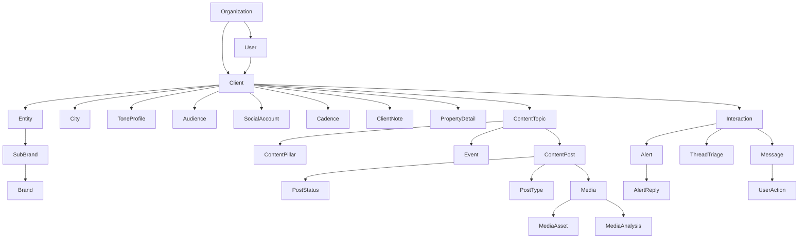
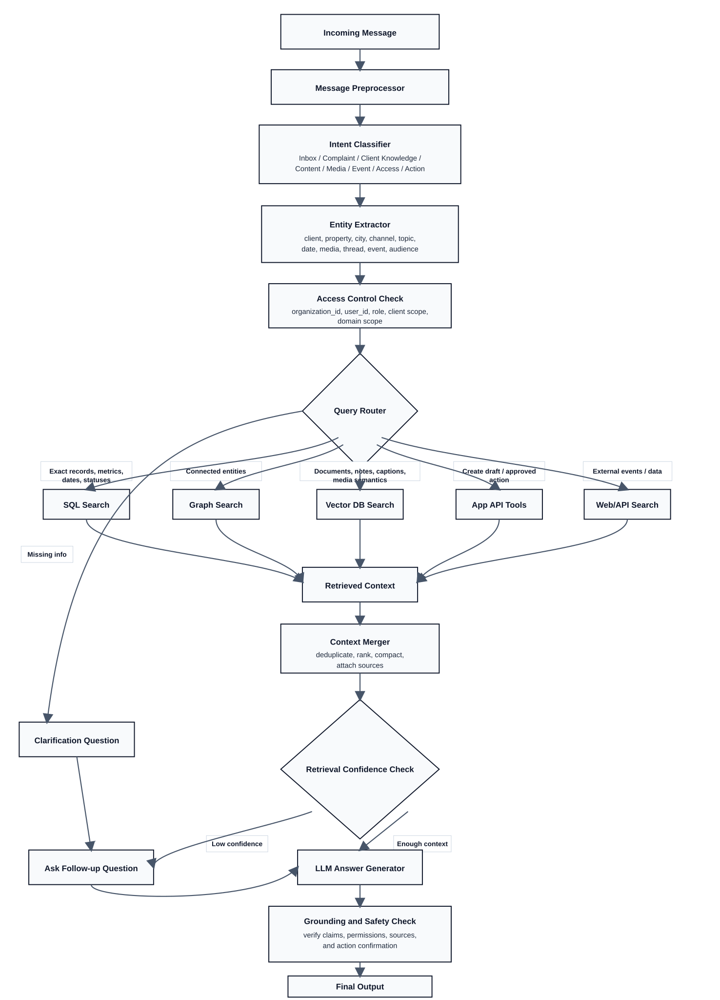
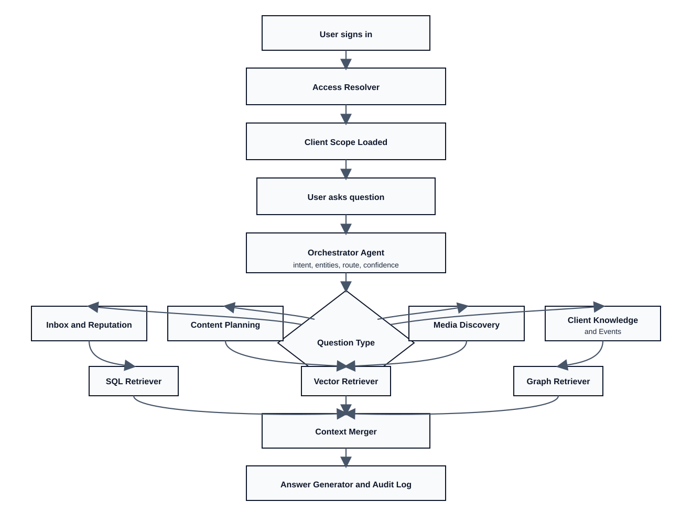

# DB-First AI App Roadmap

## Purpose

This document is the greenfield roadmap for a brand-new AI application built from the database upward.

Important boundary:

- We are **not** using the current app codebase as the product architecture.
- We are using the database and schema as the source of truth for planning.
- This roadmap is based on a **direct live database inspection performed on June 26, 2026**.

The goal is to answer:

1. What data exists in the DB?
2. Which business entities are real and usable?
3. What kinds of user questions can be answered reliably?
4. Which tables should each question touch?
5. What should be handled by SQL, vector retrieval, and graph traversal?
6. How many agents do we actually need, based on the data?
7. How should a new app be implemented safely and incrementally?

---

## 1. Executive Summary

The database already supports a meaningful multi-domain AI application, but the data is unevenly populated across domains.

### What is strong today

- Client / property master data
- Inbox / guest communication data
- Triage / alert / resolution workflow data
- Content planning and publishing workflow data
- Media library plus AI media analysis
- Event discovery data
- Tone-of-voice, audience, cadence, and brand planning inputs

### What is weak or incomplete today

- Analytics metrics
- Report definitions
- Some relationship constraints are logical only, not enforced by foreign keys
- Existing embeddings are stored as JSONB, not as production-ready vector indexes

### Recommended product direction

Build a new AI application as a **DB-first assistant platform** with:

- 1 orchestrator agent
- 4 specialist domain agents
- deterministic SQL / vector / graph services behind them

### Recommended initial agent count

`5 total agents`

1. `Orchestrator Agent`
2. `Inbox and Reputation Agent`
3. `Content Planning Agent`
4. `Media Discovery Agent`
5. `Client Knowledge and Events Agent`

Important note:

- Access control, SQL execution, vector search, and graph traversal should be implemented as deterministic services, not free-form agents.
- Do **not** start with a separate analytics agent because the analytics tables are currently too sparse.

---

## 2. Live Database Inspection Summary

### 2.1 Schemas and approximate row volume

| Schema | Tables | Approx Rows | Notes |
|---|---:|---:|---|
| `clients` | 17 | 6,898 | Core property/client configuration |
| `general` | 15 | 999,659 | Geography, events, reference tables |
| `jx_bridge` | 15 | 15,140 | Inbox, alerts, messages, triage |
| `content` | 12 | 18,147 | Planning, posts, approvals, edit history |
| `media` | 9 | 6,846 | Media library and AI analysis |
| `users` | 5 | 3,711 | Users, roles, sessions |
| `world` | 5 | 159,809 | Country/state/city reference data |
| `entity` | 4 | 2,075 | Brand/entity model |
| `organizations` | 2 | 282 | Organization ownership layer |
| `inbox` | 9 | 205 | Monitoring groups and schedules |
| `alert` | 5 | 1,005 | Alert configuration metadata |
| `ad` | 1 | 313 | Ad accounts |
| `analytics` | 2 | 0 | Not mature enough for primary analytics QA |

### 2.2 Important live coverage observations

From the live DB:

- `380` active clients
- `246` organizations
- `27` users
- `23` clients with content topics
- `45` clients with media
- `17` clients with inbox messages
- `7` clients with client notes
- `31` clients with property details
- `300` clients with tone-of-voice settings

### 2.3 Key implication

This is **not** a uniformly populated enterprise data warehouse.

It is a **multi-domain operational product database** with uneven coverage by client and module.

That means the new AI app must:

- detect which domains have data for the selected client
- refuse or clarify when a question targets an empty domain
- never assume all clients have inbox, media, events, content, notes, and analytics

---

## 3. Domain-by-Domain Database Analysis

## 3.1 Identity, Access, and Ownership Domain

### Main tables

- `users.users`
- `users.users_roles`
- `users.user_sessions`
- `organizations.organizations`
- `organizations.organization_users`
- `clients.clients`
- `clients.clients_collaborators`

### Purpose

This domain determines who the user is, which organization they belong to, and which clients they can access.

### Real join paths

- `organizations.organization_users.user_id -> users.users.id`
- `clients.clients_collaborators.user_id -> users.users.id`
- `clients.clients_collaborators.client_id -> clients.clients.id`

### Logical but not fully enforced joins

- `organizations.organization_users.organization_id -> organizations.organizations.id`
- `clients.clients.organization_id -> organizations.organizations.id`

### What this domain can answer

- Which organizations does this user belong to?
- Which clients does this user have access to?
- Who owns this organization?
- Which clients belong to this organization?

### Risk

Some of the most important access joins are not fully protected by foreign keys, so app-level validation is required.

---

## 3.2 Client / Property / Brand Knowledge Domain

### Main tables

- `clients.clients`
- `clients.client_details`
- `clients.property_details`
- `clients.client_notes`
- `clients.client_tone_of_voice_settings`
- `clients.client_target_audience`
- `clients.client_target_audience_suggestions`
- `clients.client_social_network_account`
- `clients.client_social_network_cadence`
- `clients.client_content_pillars`
- `clients.client_metric_goals`
- `entity.entity`
- `entity.entity_facility_brand`
- `entity.entity_facility_sub_brand`
- `general.social_network_type`
- `general.timezone`
- `world.cities`

### Purpose

This is the knowledge core for each client or property:

- profile
- brand tone
- location
- audience
- social accounts
- publishing cadence
- reusable notes
- content planning preferences

### What this domain can answer

- What is this property's tone of voice?
- What audiences is this client targeting?
- Which social channels does this client use?
- What cadence is expected per channel?
- What property facts are known?
- What notes/templates exist for this client?

### Data maturity notes

- `client_tone_of_voice_settings` is heavily populated and very useful
- `property_details` exists for a meaningful subset of clients
- `client_notes` exists for only a small subset of clients
- `client_metric_goals` is very sparse

---

## 3.3 Inbox / Reputation / Guest Communication Domain

### Main tables

- `jx_bridge.messages`
- `jx_bridge.messages_metadata`
- `jx_bridge.interactions`
- `jx_bridge.messages_ai_suggestions`
- `jx_bridge.thread_triage`
- `jx_bridge.alerts`
- `jx_bridge.alert_replies`
- `jx_bridge.thread_issue_sessions`
- `jx_bridge.message_replies`
- `jx_bridge.message_tags`
- `jx_bridge.user_actions`
- `jx_bridge.user_actions_types`
- `inbox.monitor_group`
- `inbox.monitor_group_client`
- `inbox.monitor_group_user`
- `inbox.monitoring_schedule`

### Purpose

This is the strongest operational domain in the DB for AI assistance.

It supports:

- guest threads
- guest messages
- reply history
- triage state
- alert escalation
- property responses
- operator actions
- monitoring assignment logic

### Important live values observed

#### `jx_bridge.messages.type`

- `reply`
- `messages`
- `comments`
- `posts`
- `alert`
- `tweet`
- `alert_reply`
- `mentions`

#### `jx_bridge.messages.last_state`

- `new`
- `archived`
- `alert_sent`
- `alert_reply_received`
- `deleted`

#### `jx_bridge.thread_triage.triage`

- `reply_now`
- `needs_property_help`
- `waiting_on_property`
- `property_responded`

### What this domain can answer

- Which guest threads need attention now?
- Which complaints are unresolved?
- Which threads are waiting on the property team?
- What did the property team reply?
- What actions did operators take?
- Which messages belong to the same interaction or thread?

### Key strength

This is the best starting domain for the new AI app because it has:

- active records
- clear workflow states
- real text content
- some semantic search support already
- human action history

---

## 3.4 Content Planning and Publishing Domain

### Main tables

- `content.content_pillar`
- `content.content_topic`
- `content.content_topic_post`
- `content.content_topic_post_media`
- `content.content_topic_post_type`
- `content.content_post_status`
- `content.content_topic_post_approval_status`
- `content.content_topic_post_comment`
- `content.content_topic_post_edit_history`
- `content.ai_planner_preferences`
- `content.exemplar_posts`

### Purpose

This domain supports campaign planning, content ideation, publishing workflow, approval, and post history.

### Important live values observed

#### `content.content_post_status`

- `ai`
- `draft`
- `sent_for_approval`
- `sent_to_creator`
- `scheduled`
- `posted`
- `sent_for_external_approval`
- `rejected`
- `deleted`

#### `content.content_topic_post_type`

- `photo`
- `reel`
- `video`
- `story`
- `text`

### Observed data quality

- strong enough for content workflow QA
- not yet strong enough for real performance analytics
- `brand_tone_score` exists and should be used as a structured ranking signal
- `ai_generated` is present and useful for workflow questions

### What this domain can answer

- What content is scheduled next week?
- Which drafts are awaiting approval?
- Which posts were AI-generated?
- Which topics are tied to upcoming events?
- Which content pillars are under-used?

---

## 3.5 Media and Visual Intelligence Domain

### Main tables

- `media.media`
- `media.media_asset`
- `media.media_analysis_ai`
- `media.media_tags`
- `media.media_type`
- `media.media_status`
- `media.media_asset_type`
- `media.edited_media`

### Purpose

This domain is strong for AI-powered media retrieval because it already contains:

- media catalog
- asset metadata
- AI-generated short descriptions
- alt text
- visual tags
- descriptive tags
- semantic keywords
- embeddings

### Important live observations

- `2200` media rows
- `2131` media analysis AI rows
- media is mostly available
- image-heavy library

### What this domain can answer

- Find visuals suitable for a wedding campaign
- Which assets match luxury, poolside, family, or wellness themes?
- Which assets have missing or weak alt text?
- Which visuals align with a specific content topic or event?

### Key insight

This is the strongest vector-search domain in the database.

---

## 3.6 Events and Local Context Domain

### Main tables

- `general.events`
- `world.cities`
- `world.states`
- `world.countries`
- `general.geography_city`
- `general.geography_state`
- `general.geography_country`

### Purpose

This domain supports local event-aware content ideation and travel-context recommendations.

### Important live observations

- `general.events` has `2958` rows
- events include:
  - name
  - date
  - type
  - location
  - description
  - audience
  - tags
  - `world_city_id`

### What this domain can answer

- What events are coming near this property?
- Which events fit family travelers, couples, wellness, weddings, or business audiences?
- Which upcoming events should influence content planning?

### Key insight

This is a high-value semantic and graph domain because it links:

- property location
- audience
- event tags
- content planning

---

## 3.7 Analytics and Reporting Domain

### Main tables

- `analytics.social_media_post`
- `clients.client_metric_goals`
- `general.metric_goals`
- `general.metric_goal_types`
- `clients.client_report_definition`
- `clients.client_report_definition_detail`

### Current reality

- `analytics.social_media_post` is empty
- `client_report_definition` is empty
- `client_report_definition_detail` is empty
- `client_metric_goals` has almost no data

### Conclusion

Do **not** build a dedicated analytics Q&A experience first.

The DB today can support:

- workflow analytics
- counts
- status breakdowns
- cadence and goal settings

It cannot yet support a full performance analytics copilot from this DB alone.

---

## 4. Key Entities and Relationships

## 4.1 Real top-level entities

- `Organization`
- `User`
- `Client`
- `Entity`
- `Brand`
- `SubBrand`
- `City`
- `SocialNetwork`
- `Interaction`
- `Message`
- `ThreadTriage`
- `Alert`
- `AlertReply`
- `ContentPillar`
- `ContentTopic`
- `ContentPost`
- `Media`
- `MediaAsset`
- `MediaAnalysis`
- `Event`

## 4.2 Recommended logical graph



## 4.3 Important relationship rules

### Ownership and access

- `Organization -> Client`
  - logical join via `clients.clients.organization_id`
- `Organization -> User`
  - logical join via `organizations.organization_users.organization_id`
- `User -> Client`
  - explicit join via `clients.clients_collaborators`

### Reputation workflow

- `Client -> Interaction`
  - via `jx_bridge.interactions.client_id`
- `Interaction -> Message`
  - via `jx_bridge.messages.interaction_id`
- `Interaction -> ThreadTriage`
  - via `jx_bridge.thread_triage.interaction_id`
- `Message -> Alert`
  - via `jx_bridge.alerts.message_id`
- `Alert -> AlertReply`
  - via `jx_bridge.alert_replies.alert_id`

### Content workflow

- `Client -> ContentTopic`
  - via `content.content_topic.client_id`
- `ContentTopic -> ContentPost`
  - via `content.content_topic_post.content_topic_id`
- `ContentPost -> Media`
  - via `content.content_topic_post_media`
- `ContentTopic -> Event`
  - via `content.content_topic.event_id`

### Media workflow

- `Client -> Media`
  - via `media.media.client_id`
- `Media -> MediaAsset`
  - via `media.media_asset.media_id`
- `Media -> MediaAnalysis`
  - via `media.media_analysis_ai.media_id`

---

## 5. Relationship Gaps and Schema Issues

These are important because they affect how reliable the AI app can be.

## 5.1 Missing or loose foreign-key relationships

Live inspection showed important ID columns without enforced FKs, including:

- `clients.clients.organization_id`
- `organizations.organization_users.organization_id`
- `entity.entity_facility_sub_brand.entity_facility_brand_id`
- `content.ai_planner_preferences.client_id`
- `inbox.monitor_group.organization_id`
- `inbox.monitoring_schedule.organization_id`
- several `jx_bridge` operational references

## 5.2 No vector indexes found

Observed:

- GIN indexes exist on `jx_bridge.messages.fts_content`
- GIN indexes exist on `jx_bridge.messages.fts_username`
- no production vector index exists on embedding fields

## 5.3 Existing embeddings are inconsistent

### `jx_bridge.messages_metadata.embedding`

- stored as JSONB array
- dimension observed: `3072`
- present for about `350` rows only

### `media.media_analysis_ai.embedding`

- stored as JSONB object
- sample shape:
  - `{ "dim": 3072, "model": "text-embedding-3-large", "vector": [...] }`
- present for `2131` rows

### Conclusion

Do not rely on the existing embedding fields directly for app retrieval.

Instead:

- normalize them into a new vector layer
- or rebuild embeddings cleanly into `pgvector`

## 5.4 Sparse analytics domain

The DB is not yet ready for a serious analytics agent because the likely fact table is empty:

- `analytics.social_media_post = 0 rows`

---

## 6. What Users Can Ask, and Which Tables to Use

## 6.1 Inbox and reputation questions

| User question | SQL tables | Vector sources | Graph need |
|---|---|---|---|
| Which guest threads need urgent attention? | `jx_bridge.messages`, `jx_bridge.thread_triage`, `clients.clients` | none | low |
| What changed since my last visit? | `jx_bridge.messages`, `jx_bridge.thread_triage`, `users.users` | none | low |
| Why is this thread waiting on property? | `jx_bridge.thread_triage`, `jx_bridge.alerts`, `jx_bridge.alert_replies`, `jx_bridge.messages` | `client_notes`, `property_details` if explanation needed | medium |
| Show unresolved negative complaints for client X | `jx_bridge.messages`, `jx_bridge.messages_metadata`, `jx_bridge.thread_triage` | none | low |
| What reply should we send? | `jx_bridge.messages`, `jx_bridge.messages_metadata` | `client_notes`, `property_details`, `client_details`, prior property response templates | medium |

## 6.2 Client knowledge questions

| User question | SQL tables | Vector sources | Graph need |
|---|---|---|---|
| What is this property's tone of voice? | `clients.client_tone_of_voice_settings`, `clients.clients` | tone guideline text, notes | low |
| What audiences do we target for this client? | `clients.client_target_audience`, `clients.client_target_audience_suggestions` | audience phrases | low |
| What property details do we know? | `clients.property_details`, `clients.client_details`, `clients.client_notes` | property detail text | low |
| Which channels does this client publish on? | `clients.client_social_network_account`, `general.social_network_type` | none | low |

## 6.3 Content planning questions

| User question | SQL tables | Vector sources | Graph need |
|---|---|---|---|
| What posts are scheduled next week? | `content.content_topic_post`, `content.content_topic`, `content.content_post_status` | none | low |
| Which drafts are waiting for approval? | `content.content_topic_post`, `content.content_topic_post_approval_status`, `content.content_post_status` | none | low |
| Which content pillars are under-used? | `clients.client_content_pillars`, `content.content_pillar` | none | low |
| Build a content idea for this event | `general.events`, `content.content_topic`, `clients.client_tone_of_voice_settings`, `clients.client_target_audience`, `clients.client_social_network_cadence` | event descriptions, exemplar posts, notes | medium |

## 6.4 Media questions

| User question | SQL tables | Vector sources | Graph need |
|---|---|---|---|
| Find images for a luxury wedding campaign | `media.media`, `media.media_analysis_ai`, `clients.clients` | media descriptions, alt text, tags, semantic keywords | medium |
| Which assets are missing alt text? | `media.media`, `media.media_analysis_ai` | none | low |
| Which visuals match this topic? | `content.content_topic`, `content.content_topic_post_media`, `media.media_analysis_ai` | media embeddings | medium |

## 6.5 Event questions

| User question | SQL tables | Vector sources | Graph need |
|---|---|---|---|
| What events are coming near this property? | `clients.clients`, `world.cities`, `general.events` | event descriptions and tags | medium |
| Which events suit couples, families, or business travelers? | `general.events`, `clients.client_target_audience` | event descriptions and audience tags | medium |

## 6.6 Access and admin questions

| User question | SQL tables | Vector sources | Graph need |
|---|---|---|---|
| Which users have access to this client? | `clients.clients_collaborators`, `users.users` | none | low |
| Which organization owns this client? | `clients.clients`, `organizations.organizations` | none | low |
| Which roles does this user have? | `users.users_roles`, `organizations.organization_users` | none | low |

## 6.7 Questions the app should not answer yet

The new app should refuse or narrow these:

- Which campaign performed best last month?
- Why did Instagram engagement drop?
- Show me ROI by channel
- Compare social performance across organizations

Reason:

- the analytics fact tables are not populated enough in this DB

---

## 7. Which Queries to Run

The new app should not generate arbitrary SQL.

It should use a library of approved query templates.

## Q1. Resolve the user's client scope

Use both organization and collaborator access where possible.

```sql
SELECT DISTINCT c.id, c.name
FROM clients.clients c
LEFT JOIN clients.clients_collaborators cc
  ON cc.client_id = c.id
 AND cc.deleted_at IS NULL
 AND cc.enabled IS TRUE
LEFT JOIN organizations.organization_users ou
  ON ou.user_id = :user_id
 AND ou.deleted_at IS NULL
 AND ou.enabled IS TRUE
WHERE c.deleted_at IS NULL
  AND (
    cc.user_id = :user_id
    OR c.organization_id = ou.organization_id
  );
```

## Q2. Fetch active inbox threads for a client

```sql
SELECT
  m.interaction_id,
  m.client_id,
  c.name AS client_name,
  MAX(m.source_timestamp) AS last_message_at,
  COUNT(*) AS message_count
FROM jx_bridge.messages m
JOIN clients.clients c ON c.id = m.client_id
WHERE m.client_id = :client_id
GROUP BY m.interaction_id, m.client_id, c.name
ORDER BY MAX(m.source_timestamp) DESC;
```

## Q3. Fetch a thread with triage and alert context

```sql
SELECT
  m.message_id,
  m.interaction_id,
  m.content,
  m.author,
  m.type,
  m.last_state,
  m.source_timestamp,
  tt.triage,
  tt.alert_reason,
  tt.property_response_text
FROM jx_bridge.messages m
LEFT JOIN jx_bridge.thread_triage tt
  ON tt.interaction_id = m.interaction_id
WHERE m.interaction_id = :interaction_id
ORDER BY m.source_timestamp;
```

## Q4. Fetch the escalation chain for a thread

```sql
SELECT
  a.alert_id,
  a.message_id,
  a.reason,
  a.recommended_action,
  a.status,
  a.timestamp,
  ar.alert_reply_id,
  ar.sender,
  ar.strippedtext,
  ar.timestamp AS reply_timestamp
FROM jx_bridge.alerts a
LEFT JOIN jx_bridge.alert_replies ar
  ON ar.alert_id = a.alert_id
WHERE a.message_id IN (
  SELECT message_id
  FROM jx_bridge.messages
  WHERE interaction_id = :interaction_id
)
ORDER BY a.timestamp, ar.timestamp;
```

## Q5. Fetch client knowledge package

```sql
SELECT
  c.id,
  c.name,
  cd.context,
  cd.metadata,
  pd.location,
  pd.overview,
  pd.amenities,
  pd.highlights,
  tv.length,
  tv.complexity,
  tv.formality,
  tv.emoji_usage,
  tv.energy_level,
  tv.use_words,
  tv.avoid_words,
  tv.custom_guidelines
FROM clients.clients c
LEFT JOIN clients.client_details cd
  ON cd.client_id = c.id AND cd.deleted_at IS NULL
LEFT JOIN clients.property_details pd
  ON pd.client_id = c.id AND pd.deleted_at IS NULL
LEFT JOIN clients.client_tone_of_voice_settings tv
  ON tv.client_id = c.id AND tv.deleted_at IS NULL
WHERE c.id = :client_id
  AND c.deleted_at IS NULL;
```

## Q6. Fetch content pipeline for a client

```sql
SELECT
  ctp.id,
  ct.name AS topic_name,
  cps.description AS post_status,
  cpt.description AS post_type,
  snt.description AS social_network,
  ctp.post_datetime,
  ctp.post_text,
  ctp.brand_tone_score,
  ctp.ai_generated
FROM content.content_topic_post ctp
JOIN content.content_topic ct
  ON ct.id = ctp.content_topic_id
LEFT JOIN content.content_post_status cps
  ON cps.id = ctp.content_post_status_id
LEFT JOIN content.content_topic_post_type cpt
  ON cpt.id = ctp.content_post_type_id
LEFT JOIN general.social_network_type snt
  ON snt.id = ctp.social_network_type_id
WHERE ct.client_id = :client_id
  AND ct.deleted_at IS NULL
  AND ctp.deleted_at IS NULL
ORDER BY ctp.post_datetime DESC NULLS LAST;
```

## Q7. Fetch content ideas linked to events

```sql
SELECT
  ct.id,
  ct.name,
  e.name AS event_name,
  e.date,
  e.type,
  e.description,
  e.tags,
  e.audience
FROM content.content_topic ct
LEFT JOIN general.events e
  ON e.id = ct.event_id
WHERE ct.client_id = :client_id
  AND ct.deleted_at IS NULL
ORDER BY e.date ASC NULLS LAST;
```

## Q8. Fetch client cadence and planning preferences

```sql
SELECT
  csnc.social_network_type_id,
  snt.description AS social_network,
  csnc.target AS posting_target,
  app.start_date,
  app.end_date,
  app.content_pillar_ids,
  app.social_network_type_ids,
  app.publishing_styles
FROM clients.client_social_network_cadence csnc
LEFT JOIN general.social_network_type snt
  ON snt.id = csnc.social_network_type_id
LEFT JOIN content.ai_planner_preferences app
  ON app.client_id = csnc.client_id
 AND app.deleted_at IS NULL
WHERE csnc.client_id = :client_id
  AND csnc.deleted_at IS NULL;
```

## Q9. Find media candidates by metadata filters

```sql
SELECT
  m.id,
  m.client_id,
  mt.description AS media_type,
  ma.short_description,
  ma.alt_text,
  ma.visual_tags,
  ma.descriptive_tags,
  ma.semantic_keywords
FROM media.media m
LEFT JOIN media.media_type mt
  ON mt.id = m.media_type_id
LEFT JOIN media.media_analysis_ai ma
  ON ma.media_id = m.id
WHERE m.client_id = :client_id
  AND m.deleted_at IS NULL;
```

## Q10. Find upcoming events near a client

```sql
SELECT
  e.id,
  e.name,
  e.date,
  e.type,
  e.location,
  e.description,
  e.audience,
  e.tags
FROM clients.clients c
JOIN general.events e
  ON e.world_city_id = c.world_city_id
WHERE c.id = :client_id
  AND c.deleted_at IS NULL
  AND e.deleted_at IS NULL
  AND e.date >= CURRENT_DATE
ORDER BY e.date ASC;
```

## Q11. Find reusable response templates or notes

```sql
SELECT
  id,
  client_id,
  title,
  note,
  type_id,
  updated_datetime
FROM clients.client_notes
WHERE client_id = :client_id
  AND deleted_at IS NULL
ORDER BY updated_datetime DESC NULLS LAST;
```

## Q12. Find posts using a given media asset

```sql
SELECT
  ctpm.media_id,
  ctp.id AS post_id,
  ctp.post_datetime,
  ctp.post_text,
  ct.name AS topic_name
FROM content.content_topic_post_media ctpm
JOIN content.content_topic_post ctp
  ON ctp.id = ctpm.content_topic_post_id
JOIN content.content_topic ct
  ON ct.id = ctp.content_topic_id
WHERE ctpm.media_id = :media_id
  AND ctp.deleted_at IS NULL
  AND ct.deleted_at IS NULL;
```

---

## 8. What Should Be Embedded

Important rule:

**Embed semantic text, not numeric metrics.**

Do not create embeddings for:

- counts
- status ids
- timestamps
- brand tone numeric score
- cadence targets
- goal integers
- enum ids

Use SQL for those.

## 8.1 Best embedding sources

| Source table | Text to embed | Chunk unit | Metadata to attach | Primary use |
|---|---|---|---|---|
| `clients.client_notes` | `title`, `note` | one note per chunk | `client_id`, `type_id`, `updated_datetime` | response templates, FAQs, operational note retrieval |
| `clients.property_details` | `overview`, `location`, `amenities`, `highlights`, `info`, `food_and_beverages` | one property profile split into logical sections | `client_id`, `updated_datetime` | core property knowledge and grounding |
| `clients.client_details` | `context`, flattened `metadata` | one client context block or one section per subtopic | `client_id`, `updated_datetime` | client-specific background and business context |
| `clients.client_tone_of_voice_settings` | synthesized text from `custom_guidelines`, `use_words`, `avoid_words`, and tone controls | one tone profile per client | `client_id`, `updated_datetime` | brand voice retrieval and style alignment |
| `clients.client_target_audience` | `audience` | one audience row per chunk | `client_id`, `is_custom`, `updated_datetime` | audience-aware planning |
| `clients.client_target_audience_suggestions` | `audience` | one suggestion per chunk | `client_id`, `updated_datetime` | ideation and audience expansion |
| `content.exemplar_posts` | `post_text` | one exemplar post per chunk | `client_id`, `social_network_type_id`, `updated_datetime` | tone and style reference retrieval |
| `content.content_topic` | `name` plus event context if present | one topic per chunk | `client_id`, `content_pillar_id`, `event_id`, `updated_datetime` | topic semantic search and idea linking |
| `content.content_topic_post` | `post_text` | one post per chunk | `content_topic_id`, `social_network_type_id`, `content_post_status_id`, `ai_generated`, `post_datetime` | caption retrieval, reuse, and style matching |
| `media.media_analysis_ai` | `short_description`, `alt_text`, `visual_tags`, `descriptive_tags`, `semantic_keywords`, `content_analysis`, `post_copy` | one media item per chunk | `media_id`, `client_id` via join, `media_type_id`, `media_status_id`, `updated_datetime` | visual semantic search and asset recommendation |
| `general.events` | `name`, `description`, `location`, `audience`, `tags` | one event per chunk | `event_id`, `world_city_id`, `date`, `type`, `updated_datetime` | event-aware planning and local discovery |
| `jx_bridge.messages` | normalized thread-level guest text built from inbound messages | one interaction or one rolling thread summary per chunk | `interaction_id`, `client_id`, `social_network_type_id`, `last_state`, `source_timestamp` | semantic inbox search and response grounding |
| `jx_bridge.thread_triage` | `alert_reason`, `property_response_text`, `ai_draft_text`, `triage_ai_reason` | one triage state record per interaction | `interaction_id`, `client_id`, `triage`, `updated_at` | escalation memory and prior resolution retrieval |

## 8.2 Existing embeddings you can reuse carefully

### Reusable candidate

- `media.media_analysis_ai.embedding`

Reason:

- large coverage
- clearly derived from rich semantic text

Required change:

- extract `embedding.vector`
- normalize into a vector store

### Partially reusable candidate

- `jx_bridge.messages_metadata.embedding`

Reason:

- only partial row coverage

Required change:

- do not depend on it as the only inbox vector source
- rebuild thread-level embeddings from normalized text

## 8.3 Recommended new vector tables

- `ai_vector_documents`
- `ai_vector_chunks`
- `ai_vector_embeddings`

Suggested chunk metadata:

```json
{
  "tenant_id": "optional",
  "organization_id": 54,
  "client_id": 553,
  "source_table": "clients.property_details",
  "source_pk": 37,
  "source_type": "property_detail",
  "visibility": "client_scoped",
  "updated_at": "2026-06-24T12:00:00Z",
  "tags": ["luxury", "wellness", "family-friendly"]
}
```

---

## 9. How the New App Should Access the DB

## 9.1 Hard rule

Agents do **not** get raw database credentials.

They call deterministic services.

## 9.2 Recommended access layers

### Layer 1: Access Resolver

- input: authenticated user id
- output: allowed organization ids, client ids, and domains

### Layer 2: SQL Retriever Service

- executes approved query templates only
- always injects scope filters
- returns structured rows

### Layer 3: Vector Retriever Service

- filters by allowed client or organization scope
- then performs semantic search

### Layer 4: Graph Retriever Service

- reads only the subset of graph nodes and edges inside allowed scope

### Layer 5: Answer Composer

- merges SQL, vector, and graph context
- produces grounded answer with sources

## 9.3 DB security rules

- create a dedicated read-only app role
- separate read/write credentials
- no arbitrary LLM-generated SQL in production
- all retriever calls logged
- all user scope checks applied before query execution

---

## 10. Recommended Agent Design

## 10.1 Recommended production shape

Start with **1 orchestrator plus 4 specialists**.

### Agent 1. Orchestrator Agent

Purpose:

- classify the user question
- resolve which domain is needed
- choose SQL only, SQL + vector, SQL + graph, or clarification

### Agent 2. Inbox and Reputation Agent

Uses:

- `jx_bridge.*`
- `inbox.*`
- `clients.client_notes`
- `clients.property_details`

Questions:

- guest complaints
- triage
- escalation
- response drafting
- operator actions

### Agent 3. Content Planning Agent

Uses:

- `content.*`
- `clients.client_content_pillars`
- `clients.client_target_audience`
- `clients.client_social_network_cadence`
- `content.ai_planner_preferences`
- `general.events`

Questions:

- content ideas
- post planning
- approval workflow
- scheduled content
- under-used pillars

### Agent 4. Media Discovery Agent

Uses:

- `media.*`
- `content.content_topic_post_media`

Questions:

- asset search
- visual matching
- accessibility gaps
- creative recommendation

### Agent 5. Client Knowledge and Events Agent

Uses:

- `clients.*`
- `organizations.*`
- `entity.*`
- `general.events`
- `world.*`

Questions:

- tone of voice
- client profile
- audience
- event fit
- ownership and access context

## 10.2 Why not more agents?

Because the current DB does not justify it.

Too many agents would create:

- routing complexity
- overlapping access rules
- repeated joins
- harder evaluation

## 10.3 Why not fewer?

Because the data clearly separates into 4 real business domains:

- inbox
- content
- media
- client knowledge plus events

---

## 11. Should We Use a Graph Layer?

Yes, but only after SQL and vector retrieval are stable.

## 11.1 Why graph is useful here

The DB contains many connected entities across domains:

- organization -> client -> property knowledge -> content -> media -> event
- client -> interaction -> messages -> alert -> alert reply
- user -> organization -> client -> actions

Graph is useful for:

- multi-hop reasoning
- relationship explanations
- impact analysis
- source traceability

## 11.2 Recommended graph nodes

- `Organization`
- `User`
- `Role`
- `Client`
- `Entity`
- `Brand`
- `SubBrand`
- `City`
- `SocialNetwork`
- `ToneProfile`
- `Audience`
- `ClientNote`
- `PropertyDetail`
- `Interaction`
- `Message`
- `ThreadTriage`
- `Alert`
- `AlertReply`
- `ContentPillar`
- `ContentTopic`
- `ContentPost`
- `Media`
- `MediaAsset`
- `MediaAnalysis`
- `Event`

## 11.3 Recommended graph edges

- `(User)-[:MEMBER_OF]->(Organization)`
- `(Organization)-[:OWNS]->(Client)`
- `(User)-[:HAS_CLIENT_ACCESS]->(Client)`
- `(Client)-[:LOCATED_IN]->(City)`
- `(Client)-[:HAS_TONE]->(ToneProfile)`
- `(Client)-[:TARGETS]->(Audience)`
- `(Client)-[:HAS_NOTE]->(ClientNote)`
- `(Client)-[:HAS_PROPERTY_DETAIL]->(PropertyDetail)`
- `(Client)-[:HAS_INTERACTION]->(Interaction)`
- `(Interaction)-[:HAS_MESSAGE]->(Message)`
- `(Interaction)-[:HAS_TRIAGE]->(ThreadTriage)`
- `(Interaction)-[:RAISED_ALERT]->(Alert)`
- `(Alert)-[:HAS_REPLY]->(AlertReply)`
- `(Client)-[:HAS_TOPIC]->(ContentTopic)`
- `(ContentTopic)-[:USES_PILLAR]->(ContentPillar)`
- `(ContentTopic)-[:RELATED_TO]->(Event)`
- `(ContentTopic)-[:HAS_POST]->(ContentPost)`
- `(ContentPost)-[:USES_MEDIA]->(Media)`
- `(Media)-[:HAS_ASSET]->(MediaAsset)`
- `(Media)-[:HAS_ANALYSIS]->(MediaAnalysis)`

## 11.4 Graph sync rule

The SQL database remains the source of truth.

Graph is a read model only.

---

## 12. App Flow

### 12.1 Detailed orchestration diagram



### 12.2 Simplified app flow



---

## 13. Example Question-to-Answer Flows

## Example 1. "Which guest complaints are still unresolved for Snow Villa?"

### Route

- Orchestrator
- Inbox and Reputation Agent
- SQL first
- vector optional if explanation or draft is requested

### Tables

- `clients.clients`
- `jx_bridge.messages`
- `jx_bridge.messages_metadata`
- `jx_bridge.thread_triage`

### Logic

1. resolve client id for "Snow Villa"
2. fetch threads with negative or complaint-like content
3. exclude archived or resolved
4. rank by recency and triage severity

### Output

- list of open complaint threads
- triage state
- last guest message
- whether property input is pending

## Example 2. "Find media suitable for a luxury wedding campaign in London."

### Route

- Orchestrator
- Media Discovery Agent
- SQL + vector
- graph optional if client context is provided

### Tables

- `media.media`
- `media.media_analysis_ai`
- `clients.client_tone_of_voice_settings`
- `clients.client_target_audience`
- `general.events` if event context is needed

### Logic

1. build semantic query from "luxury wedding"
2. filter assets by client scope if client selected
3. vector search over media AI descriptions and tags
4. rerank by tone alignment and audience fit

### Output

- ranked assets
- why each asset matches
- supporting tags and descriptions

## Example 3. "What posts are scheduled next week for client 553?"

### Route

- Orchestrator
- Content Planning Agent
- SQL only

### Tables

- `content.content_topic_post`
- `content.content_topic`
- `content.content_post_status`
- `general.social_network_type`

### Logic

1. resolve next-week date range
2. filter posts by client
3. filter status to scheduled / posted candidate workflow
4. return grouped by day and channel

## Example 4. "What events near this property should influence next month's content calendar?"

### Route

- Orchestrator
- Client Knowledge and Events Agent
- SQL + vector + graph

### Tables

- `clients.clients`
- `general.events`
- `clients.client_target_audience`
- `clients.client_social_network_cadence`
- `content.content_pillar`

### Logic

1. resolve property city
2. fetch nearby upcoming events
3. semantic rank events by audience fit and content potential
4. map suggested events to likely content pillars and channels

---

## 14. What the App Should Not Do

Until more data is available, the new app should not promise:

- reliable social performance analytics
- campaign ROI analysis
- trend diagnosis by engagement metrics
- revenue attribution
- fully automatic posting decisions

Reason:

- the current DB does not contain enough populated analytics fact data for those tasks

---

## 15. Implementation Roadmap

## Phase 0. Freeze a DB Snapshot and Data Dictionary

### Goal

Turn the inspected schema into a stable source contract.

### Tasks

1. export schema metadata
2. document all user-facing tables
3. tag tables as:
   - primary
   - secondary
   - admin
   - reference
   - do-not-expose
4. define canonical client scope logic
5. define canonical relationship map

### Deliverables

- DB dictionary
- access model document
- relationship map

---

## Phase 1. Build the Read-Only Query Layer

### Goal

Support trustworthy answers from SQL only.

### Tasks

1. create read-only DB role
2. build query template library
3. build access resolver
4. build structured retriever service
5. add logging and query tracing

### Acceptance criteria

- inbox, client knowledge, content workflow, and event questions can be answered from SQL

---

## Phase 2. Build the Vector Layer

### Goal

Support semantic search over unstructured data.

### Tasks

1. normalize source text from selected tables
2. create chunking pipeline
3. build `pgvector` tables
4. re-embed media and client knowledge
5. add vector search API
6. add metadata filters

### Acceptance criteria

- semantic search works for:
  - media search
  - note retrieval
  - property knowledge
  - event matching
  - reply-grounding

---

## Phase 3. Build the Graph Layer

### Goal

Support multi-hop relationship reasoning.

### Tasks

1. build graph node and edge schema
2. add SQL-to-graph sync jobs
3. resolve missing enforced relationships in app logic
4. expose graph retriever
5. build relationship explanation responses

### Acceptance criteria

- the app can explain:
  - why an answer was chosen
  - how a client is connected to events, posts, media, and workflows

---

## Phase 4. Build the Agent Runtime

### Goal

Introduce the orchestrator and specialist agents.

### Tasks

1. implement orchestrator
2. implement four specialists
3. add routing rules
4. add confidence and clarification logic
5. add source citation formatting

### Acceptance criteria

- user questions are routed correctly by domain
- responses are grounded and scoped

---

## Phase 5. Build the New App UI

### Goal

Launch the greenfield application.

### Tasks

1. design client / property selector
2. design question composer
3. show answer sources
4. show structured cards for:
   - inbox threads
   - posts
   - media assets
   - events
5. add follow-up questions
6. add audit history view

### Acceptance criteria

- users can ask cross-domain DB questions from one interface

---

## Phase 6. Add Controlled Actions

### Goal

Move from read-only advice to supervised actions.

### Possible actions later

- prepare guest reply draft
- prepare escalation packet
- create content brief
- shortlist media
- produce event-aware content suggestions

### Hard rule

- no writes without confirmation
- no autonomous DB writes from agent reasoning alone

---

## 16. Recommended App Modules

Build the new app with these modules:

1. `Auth and Scope Module`
2. `SQL Retrieval Module`
3. `Vector Retrieval Module`
4. `Graph Retrieval Module`
5. `Agent Orchestration Module`
6. `Audit and Observability Module`
7. `UI Module`

Optional later:

8. `Action Execution Module`
9. `Feedback and Evaluation Module`

---

## 17. Open Questions

These need confirmation before final implementation:

1. Should organization-level access override collaborator-level access, or should both be required?
2. Is `clients.clients.organization_id` always valid, despite missing FK enforcement?
3. What does `clients.client_notes.type_id` map to exactly in business terms?
4. What does `general.events.type_id` map to?
5. Is `analytics.social_media_post` expected to be populated from another pipeline soon?
6. Are report definitions intentionally empty or just not backfilled yet?
7. Should the new app include action workflows in v1, or remain read-only first?

---

## 18. Final Recommendation

For this database, the best new app is:

- a **DB-first AI assistant**
- **read-only first**
- **SQL-first**
- **vector-second**
- **graph-third**
- **5-agent logical design**

### Best initial scope

Launch with:

- inbox and reputation Q&A
- client knowledge Q&A
- content planning Q&A
- media search
- event-aware ideation

### Defer until data improves

- performance analytics copilot
- ROI analytics
- advanced report generation based on analytics fact tables

### Final product principle

The DB already supports a strong operational AI assistant.

The right implementation is not "more agents first."

The right implementation is:

1. precise access control
2. approved SQL retrieval
3. high-quality vector search on semantic fields
4. graph reasoning on real entity relationships
5. grounded answers with citations

---

## 19. Appendix A: Full Schema Inventory by Domain

This appendix is a direct inventory of the live tables that matter for planning the new app.

## 19.1 Identity and access

- `users.users`
- `users.users_roles`
- `users.user_sessions`
- `users.invited_users`
- `users.email_otp_verification`
- `organizations.organizations`
- `organizations.organization_users`

## 19.2 Client and property master

- `clients.clients`
- `clients.client_details`
- `clients.client_details_snapshots`
- `clients.property_details`
- `clients.client_notes`
- `clients.client_access_keys`
- `clients.clients_collaborators`
- `clients.client_social_network_account`
- `clients.client_social_network_cadence`
- `clients.client_content_pillars`
- `clients.client_target_audience`
- `clients.client_target_audience_suggestions`
- `clients.client_tone_of_voice_settings`
- `clients.client_metric_goals`
- `clients.client_report_definition`
- `clients.client_report_definition_detail`
- `clients.client_ad_accounts`

## 19.3 Brand and entity model

- `entity.entity`
- `entity.entity_facility_brand`
- `entity.entity_facility_sub_brand`
- `entity.entity_social_network_account`

## 19.4 Inbox, reputation, and actions

- `jx_bridge.messages`
- `jx_bridge.messages_metadata`
- `jx_bridge.messages_ai_suggestions`
- `jx_bridge.messages_states`
- `jx_bridge.interactions`
- `jx_bridge.alerts`
- `jx_bridge.alert_replies`
- `jx_bridge.alert_reply_attachments`
- `jx_bridge.thread_triage`
- `jx_bridge.thread_issue_sessions`
- `jx_bridge.message_replies`
- `jx_bridge.message_tags`
- `jx_bridge.guest_notes`
- `jx_bridge.user_actions`
- `jx_bridge.user_actions_types`

## 19.5 Inbox operations and monitoring

- `inbox.monitor_group`
- `inbox.monitor_group_client`
- `inbox.monitor_group_user`
- `inbox.monitoring_schedule`
- `inbox.out_of_office`
- `inbox.client_details`
- `inbox.legacy_inbox_stream`
- `inbox.legacy_inbox_stream_subscriptions`
- `inbox.legacy_inbox_stream_type`

## 19.6 Content planning and publishing

- `content.ai_planner_preferences`
- `content.content_pillar`
- `content.content_topic`
- `content.content_topic_post`
- `content.content_topic_post_media`
- `content.content_topic_post_media_tags`
- `content.content_topic_post_type`
- `content.content_post_status`
- `content.content_topic_post_approval_status`
- `content.content_topic_post_comment`
- `content.content_topic_post_edit_history`
- `content.exemplar_posts`

## 19.7 Media and AI visual analysis

- `media.media`
- `media.media_asset`
- `media.media_asset_type`
- `media.media_status`
- `media.media_type`
- `media.media_tags`
- `media.media_tag_source_type`
- `media.media_analysis_ai`
- `media.edited_media`

## 19.8 Events, geography, and reference data

- `general.events`
- `general.social_network_type`
- `general.metric_goals`
- `general.metric_goal_types`
- `general.timezone`
- `general.hotels`
- `general.geography_city`
- `general.geography_state`
- `general.geography_country`
- `general.geography_region`
- `general.auth_data_storage`
- `general.magic_link_token`
- `general.twitter_oauth_temp`
- `general.valid_bihar_city`
- `general.geography_city_backup_bihar`
- `world.cities`
- `world.states`
- `world.countries`
- `world.regions`
- `world.subregions`

## 19.9 Alert configuration and ad accounts

- `alert.alert_category_type`
- `alert.alert_group`
- `alert.alert_group_user`
- `alert.alert_user`
- `alert.legacy_alert_type`
- `ad.ad_account`

## 19.10 Analytics and reporting readiness

- `analytics.social_media_post`
- `analytics.linkedin_geo_display_name`

## 19.11 Miscellaneous non-core tables

- `public.user_rate_limit`
- `public.students`
- `public.alert_reply_attachments`

## 19.12 Tables not recommended as first-class AI answer sources

These should usually remain reference-only, admin-only, or hidden from end users:

- `general.magic_link_token`
- `general.twitter_oauth_temp`
- `users.email_otp_verification`
- `public.user_rate_limit`
- `clients.client_access_keys`
- low-level auth/session tables unless the question is strictly administrative
