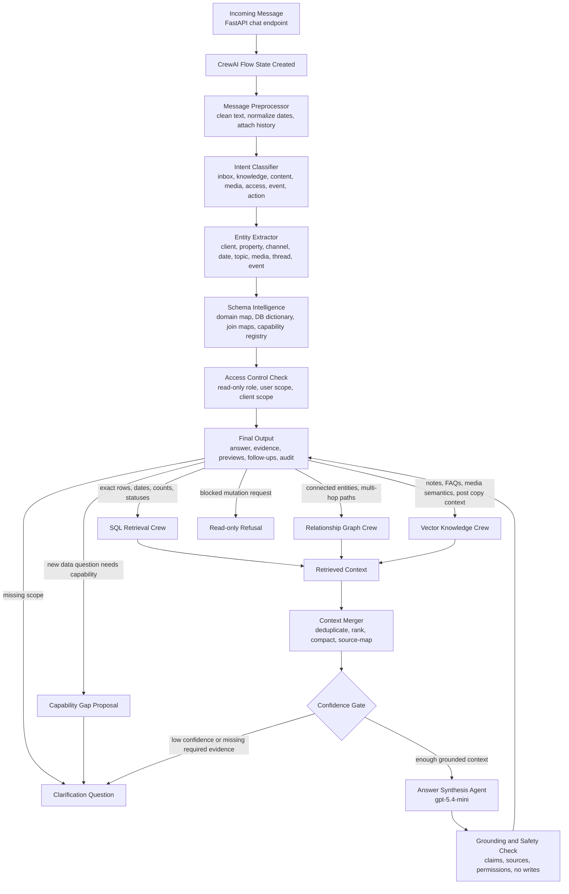

# CrewAI Agent Orchestration Architecture

This document defines the target CrewAI orchestration architecture for the Soho AI read-only intelligence assistant.

It is intentionally designed around the existing `ai-agent-detailed-flow.svg` pipeline and the current project requirement: agents can read approved data, reason over retrieved context, and produce grounded answers, but no agent can write to the database or mutate the app.

## 1. Direct Answer

Yes, the app should follow `ai-agent-detailed-flow.svg`.

This is not a chatbot architecture. It is a DB-grounded intelligence architecture.

That means the assistant should not depend on a fixed list of supported sample questions. It should use the schema, join maps, embeddings, graph relationships, and read-only retrieval tools to decide the safest answer path for any app-data question.

The current POC already follows most of the flow conceptually:

| SVG stage | Current POC status | Current implementation area | Target CrewAI owner |
| --- | --- | --- | --- |
| Incoming Message | implemented | `POST /api/agent-poc/chat` | CrewAI Flow `incoming_message` |
| Message Preprocessor | implemented | intake service | Flow stage with deterministic tool |
| Intent Classifier | implemented | intake and orchestrator services | Flow stage with router decision |
| Entity Extractor | implemented | client/channel/date extraction | Flow stage with deterministic tool |
| Access Control Check | partially implemented | read-only policy and client scope | Flow stage before retrieval |
| Query Router | implemented | routing matrix | CrewAI Flow router |
| SQL Search | implemented | approved SQL retrievers | SQL Retrieval Crew |
| Graph Search | implemented locally | derived graph read model | Relationship Crew |
| Vector DB Search | implemented | knowledge and metric embeddings | Knowledge and Media Crews |
| App API Tools | intentionally disabled | read-only only | blocked unless tool is read-only |
| Web/API Search | not enabled by default | not part of POC runtime | optional future whitelisted enrichment |
| Retrieved Context | implemented | retrieval result objects | shared context state |
| Context Merger | implemented | context merger service | Context Merge stage |
| Retrieval Confidence Check | implemented | confidence policy | Confidence Gate stage |
| Clarification Question | implemented | clarification branch | Clarification branch |
| LLM Answer Generator | implemented | OpenAI final answer synthesis | Answer Synthesis Agent |
| Grounding and Safety Check | implemented | safety service | Safety Agent and deterministic checks |
| Final Output | implemented | API response and UI rendering | Flow final output |

The target change is not to let agents freely control the application. The target change is to let CrewAI coordinate the existing deterministic retrieval, grounding, and safety layers using a structured Flow.

## 1.1 Intelligence Assistant Contract

The assistant must classify every app/DB-related question into one safe outcome:

| Outcome | Required behavior |
| --- | --- |
| `direct_answer` | answer from one grounded route with enough evidence |
| `multi_source_answer` | combine SQL, vector, graph, or media preview evidence when one table is not enough |
| `relationship_answer` | explain connected entities using graph paths or approved multi-hop joins |
| `partial_answer` | answer only the portion supported by data and state what is missing |
| `clarification` | ask for missing client, date, channel, metric, entity, or scope |
| `not_supported` | explain that approved data does not contain a dependable source |
| `read_only_refusal` | refuse mutation while offering read-only analysis |

The assistant should say "I cannot verify this from approved data" only after it has checked the relevant schema domain or when the current capability does not exist yet.

The product should expand by adding:

- schema dictionary entries
- join maps
- SQL templates
- graph edges
- embedding sources
- capability tests
- answer format policies

It should not expand by hardcoding more prompt examples.

## 1.2 Schema Intelligence Layer

CrewAI orchestration should include a schema-intelligence layer inside the Flow Orchestrator.

Responsibilities:

1. understand what business object the user is asking about
2. map words like `competitors`, `bookings`, `campaigns`, `approval`, `media`, `performance`, and `guest complaints` to schema domains
3. inspect the existing capability registry
4. select a known capability when available
5. propose a new safe capability when no existing route covers the question
6. refuse or ask for clarification when the DB has no dependable source

Important boundary:

- the schema-intelligence layer may plan
- it may not execute arbitrary SQL in the current POC
- production can add a read-only SQL compiler later, but only with schema allow-lists, tenant scope, row limits, explain-plan checks, and evaluation coverage

## 2. CrewAI Fit

CrewAI has three concepts that map well to this app:

| CrewAI concept | How this app should use it |
| --- | --- |
| Flow | The fixed pipeline from incoming message to final output |
| Crew | A small specialist team used inside a route, such as content intelligence or complaint lookup |
| Agent | A role with a narrow job, typed tools, and a structured output contract |

Use CrewAI Flow as the primary orchestrator because this product has strict ordered stages: preprocess, classify, check access, route, retrieve, merge, confidence-check, answer, safety-check.

Use CrewAI Crews inside route branches because each branch may require a small chain of specialist tasks. For example, a post-performance question needs exact SQL retrieval, media context, metric context, and grounded synthesis.

Do not use a fully autonomous hierarchical Crew for the whole app in the first production version. A hierarchical manager can be useful later, but the first implementation must stay predictable and auditable.

References:

- CrewAI docs describe agents, crews, and flows for building collaborative AI systems: https://docs.crewai.com/
- CrewAI processes include sequential and hierarchical task execution: https://docs.crewai.com/en/concepts/processes
- CrewAI flows support event-driven orchestration and structured state: https://docs.crewai.com/en/concepts/flows
- CrewAI tasks support structured outputs, including Pydantic models: https://docs.crewai.com/en/concepts/tasks
- CrewAI tools are the right boundary for custom read-only retrievers: https://docs.crewai.com/en/concepts/tools
- CrewAI installation requires Python 3.10 or newer and below 3.14: https://docs.crewai.com/en/installation

## 3. Core Architecture Decision

The correct architecture is:

```text
FastAPI endpoint
  -> CrewAI Flow
    -> deterministic intake and scope tools
    -> schema intelligence and capability planner
    -> route decision
    -> selected specialist Crew
    -> SQL, vector, or graph read-only tools
    -> context merge
    -> confidence gate
    -> answer synthesis
    -> grounding and safety
    -> final response
```

The wrong architecture is:

```text
User question
  -> one general LLM agent
    -> agent writes SQL freely
    -> agent queries anything
    -> agent writes final answer
```

That second approach will cause wrong client resolution, cross-client leakage, fabricated analytics, unsafe SQL, and inconsistent answers.

## 4. Target Runtime Flow



## 5. CrewAI State Model

Every run should use one shared state object. The LLM should never hold hidden business state that is not represented here.

```python
from pydantic import BaseModel, Field

class AgentRunState(BaseModel):
    run_id: str
    query: str
    normalized_query: str | None = None
    user_id: int | None = None
    organization_id: int | None = None
    client_id: int | None = None
    property_name: str | None = None
    language: str = "en"

    intent: str | None = None
    capability: str | None = None
    route: str | None = None
    capability_state: str | None = None
    missing_fields: list[str] = Field(default_factory=list)

    entities: dict = Field(default_factory=dict)
    access_scope: dict = Field(default_factory=dict)
    retrieval_plan: dict = Field(default_factory=dict)
    capability_gap: dict = Field(default_factory=dict)

    sql_results: list[dict] = Field(default_factory=list)
    vector_results: list[dict] = Field(default_factory=list)
    graph_results: list[dict] = Field(default_factory=list)
    media_previews: list[dict] = Field(default_factory=list)

    merged_context: dict = Field(default_factory=dict)
    confidence: dict = Field(default_factory=dict)
    answer_package: dict = Field(default_factory=dict)
    safety_review: dict = Field(default_factory=dict)
    follow_up_questions: list[str] = Field(default_factory=list)
    audit_event: dict = Field(default_factory=dict)
```

## 6. CrewAI Flow Design

The Flow should own the full SVG pipeline.

```python
from crewai.flow.flow import Flow, listen, router, start

class ReadOnlyIntelligenceFlow(Flow[AgentRunState]):
    @start()
    def incoming_message(self):
        # create run id and attach raw request
        return self.state

    @listen(incoming_message)
    def preprocess_message(self):
        # clean query, normalize date phrases, attach history
        return self.state

    @listen(preprocess_message)
    def classify_and_extract(self):
        # run intent classifier and entity extractor
        return self.state

    @listen(classify_and_extract)
    def schema_intelligence(self):
        # map question to domains, existing capabilities, and candidate join paths
        return self.state

    @listen(schema_intelligence)
    def check_access(self):
        # resolve user/client scope and enforce read-only policy
        return self.state

    @router(check_access)
    def route_query(self):
        # returns one route label:
        # clarification, blocked_action, sql, graph, vector, hybrid
        return self.state.route

    @listen("sql")
    def run_sql_retrieval(self):
        return run_sql_retrieval_crew(self.state)

    @listen("graph")
    def run_graph_retrieval(self):
        return run_relationship_crew(self.state)

    @listen("vector")
    def run_vector_retrieval(self):
        return run_vector_knowledge_crew(self.state)

    @listen("hybrid")
    def run_hybrid_retrieval(self):
        return run_hybrid_content_crew(self.state)

    @listen(run_sql_retrieval, run_graph_retrieval, run_vector_retrieval, run_hybrid_retrieval)
    def merge_context(self):
        return self.state

    @listen(merge_context)
    def confidence_gate(self):
        return self.state

    @router(confidence_gate)
    def answer_or_clarify(self):
        return "answer" if self.state.confidence.get("enough_context") else "clarification"

    @listen("answer")
    def synthesize_answer(self):
        return self.state

    @listen(synthesize_answer)
    def safety_check(self):
        return self.state

    @listen(safety_check)
    def final_output(self):
        return self.state.answer_package
```

## 7. Agent List

The target architecture uses one Flow orchestrator and six read-only specialist agents.

| Agent | Primary role | Can use LLM? | Can access DB directly? | Approved tools |
| --- | --- | --- | --- | --- |
| Flow Orchestrator | Owns pipeline, route labels, state transitions | limited | no | intake, classifier, scope, route matrix |
| Inbox and Complaint Agent | Finds complaints, active threads, triage buckets, waiting-on-property state | optional for summarization | no | inbox SQL templates |
| Client Knowledge and FAQ Agent | Answers property facts, FAQs, notes, tone, audience, policies | yes, after vector retrieval | no | knowledge vector search, scoped client lookup |
| Content Intelligence Agent | Handles schedules, approvals, post copy, media used, post performance | yes, after exact SQL | no | content SQL templates, metric vector search, media preview tool |
| Media Discovery Agent | Finds and explains suitable media assets | yes, after media evidence | no | media vector search, media analysis lookup |
| Access and Relationship Agent | Answers collaborators, organization, events, and entity relationship paths | optional for path narration | no | access SQL templates, graph path lookup |
| Grounding and Safety Agent | Validates answer against sources and read-only policy | optional critique only | no | evidence checker, policy checker |

Important: "Can access DB directly" is always no. Agents call typed tools. Tools call repositories and approved templates.

## 8. Specialist Crew Design

### 8.1 Inbox and Complaint Crew

Use for:

- `is there any complaint for Hotel Ramtin?`
- `show complaint threads for Snow Villa`
- `what is waiting on property for client 7403?`

Process:

1. Validate `client_id`.
2. Run `inbox_lookup` SQL template.
3. Filter to complaint or triage intent when relevant.
4. Return exact counts by bucket.
5. Include the most relevant threads only.
6. Refuse to mention another client unless rows actually match that client.

Required tables:

- `jx_bridge.interactions`
- `jx_bridge.messages`
- `jx_bridge.thread_triage`
- `jx_bridge.alerts`
- `jx_bridge.alert_replies`

Output contract:

```python
class InboxComplaintOutput(BaseModel):
    client_id: int
    client_name: str
    total_active_threads: int
    complaint_threads: list[dict]
    triage_counts: dict[str, int]
    evidence_tables: list[str]
```

### 8.2 Client Knowledge and FAQ Crew

Use for:

- `does Hotel Ramtin have a pool?`
- `what do we know about Snow Villa?`
- `what tone should we use for Maison Aurelia?`

Process:

1. Validate `client_id`.
2. Search `general.knowledge_embeddings`.
3. Prefer exact source types in this order:
   - property detail
   - FAQ
   - client note
   - tone and audience
4. For yes/no amenity questions, answer only if an explicit positive or negative source exists.
5. If evidence is missing, say it is not available in approved data.

Required tables:

- `general.knowledge_embeddings`
- `clients.property_details`
- `clients.client_notes`
- `clients.client_details`
- `clients.client_tone_of_voice_settings`
- `clients.client_target_audience`
- `clients.client_target_audience_suggestions`

Output contract:

```python
class KnowledgeOutput(BaseModel):
    client_id: int
    client_name: str
    answerable: bool
    answer_type: str
    evidence: list[dict]
    missing_evidence_reason: str | None = None
```

### 8.3 Content Intelligence Crew

Use for:

- `what posts are scheduled next week for Hotel d'Angleterre?`
- `what is the post copy for the last TikTok post for client 7403?`
- `how is the last Instagram post performing?`

Process:

1. Validate `client_id`.
2. Resolve channel and date range.
3. Select approved SQL template:
   - `content_schedule_lookup`
   - `content_approval_lookup`
   - `content_post_detail_lookup`
   - `post_performance_lookup`
4. Use SQL for exact post, media, status, schedule, and metric values.
5. Use metric embeddings only for metric semantics, not numeric values.
6. Attach media preview objects when media rows exist.
7. If metrics are missing, say which post was found and which metric columns are unavailable.

Required tables:

- `content.content_topic`
- `content.content_topic_post`
- `content.content_post_status`
- `content.content_topic_post_approval_status`
- `content.content_topic_post_media`
- `media.media`
- `media.media_analysis_ai`
- `analytics.social_media_post`
- `analytics.metric_embeddings`
- `general.social_network_type`

Output contract:

```python
class ContentIntelligenceOutput(BaseModel):
    client_id: int
    client_name: str
    query_kind: str
    posts: list[dict]
    metrics: dict | None = None
    media_previews: list[dict] = []
    evidence_tables: list[str]
    partial_reason: str | None = None
```

### 8.4 Media Discovery Crew

Use for:

- `find dining media for Hotel Ramtin`
- `which media should we use for a family weekend post?`
- `show media related to spa and wellness for client 1004`

Process:

1. Validate `client_id`.
2. Search media analysis and knowledge embeddings.
3. Return only media assets belonging to the scoped client.
4. Explain fit using media analysis text.
5. Attach preview thumbnails when available.

Required tables:

- `media.media`
- `media.media_analysis_ai`
- `content.content_topic_post_media`
- `general.knowledge_embeddings`

Output contract:

```python
class MediaDiscoveryOutput(BaseModel):
    client_id: int
    client_name: str
    media: list[dict]
    recommendation_reason: str
    evidence_tables: list[str]
```

### 8.5 Access and Relationship Crew

Use for:

- `who has access to Hotel Ramtin?`
- `how is client 7403 connected to posts, media, metrics and events?`
- `what events are near Snow Villa?`
- `who are likely competitors of Hotel Ramtin?`

Process:

1. Validate `client_id` or city.
2. For access, run exact SQL templates.
3. For competitor questions, run `competitor_lookup` and label output as likely comparables unless an official competitor source exists.
4. For relationship questions, read `entity.entity` and `entity.entity_relationship`.
5. Group paths by business concept: content, media, metrics, events, inbox, knowledge, users.
6. Return representative paths, not a raw graph dump.

Required tables:

- `clients.clients`
- `clients.clients_collaborators`
- `clients.client_marketing_settings`
- `clients.property_details`
- `clients.client_target_audience`
- `users.users`
- `organizations.organization_users`
- `general.events`
- `world.cities`
- `entity.entity`
- `entity.entity_relationship`

Output contract:

```python
class RelationshipOutput(BaseModel):
    client_id: int
    client_name: str
    relationship_groups: dict[str, list[dict]]
    representative_paths: list[str]
    evidence_tables: list[str]
```

### 8.6 Grounding and Safety Agent

Use for every answer before it leaves the backend.

Process:

1. Verify every claim is supported by SQL rows, vector evidence, or graph paths.
2. Verify client names in the final answer match the scoped client.
3. Verify no write action is implied as completed.
4. Verify unsupported pricing, booking, private data, and missing facts are not fabricated.
5. If the answer fails, replace it with a safe fallback or clarification.

Output contract:

```python
class SafetyOutput(BaseModel):
    passed: bool
    risk_level: str
    blocked_reasons: list[str]
    corrected_answer: str | None = None
```

## 9. Tool Boundary

CrewAI tools should be thin wrappers over existing repository services. They should not create a new path around the existing safety model.

| Tool | Purpose | Write access | Notes |
| --- | --- | --- | --- |
| `ClientResolverTool` | Resolve property names, aliases, and client IDs | no | must return ambiguity if multiple matches |
| `AccessScopeTool` | Resolve allowed clients for user/org | no | must run before retrieval |
| `ApprovedSQLTemplateTool` | Execute one approved SQL template | no | no free-form SQL argument |
| `KnowledgeVectorSearchTool` | Search `general.knowledge_embeddings` | no | scoped by client |
| `MetricVectorSearchTool` | Search `analytics.metric_embeddings` | no | never returns numeric truth by itself |
| `GraphPathTool` | Query derived graph read model | no | approved graph query templates only |
| `MediaPreviewTool` | Build preview objects from media rows | no | no image generation at chat time |
| `ContextMergeTool` | Deduplicate and rank evidence | no | deterministic |
| `SafetyReviewTool` | Validate answer against sources and policy | no | deterministic first |

Blocked permanently in the read-only assistant:

- arbitrary SQL execution
- `INSERT`, `UPDATE`, `DELETE`, `UPSERT`, `MERGE`, `TRUNCATE`, `CREATE`, `ALTER`, `DROP`
- send reply
- publish post
- approve post
- assign thread
- create alert
- upload media
- grant or revoke access

## 10. Database Access Model

Agents must not receive database credentials.

Correct model:

```text
Agent
  -> CrewAI Tool
    -> repository function
      -> approved SQL template or vector query
        -> read-only DB connection
```

Required safeguards:

1. Use a database role that has only `SELECT`.
2. Keep SQL templates enumerated by capability key.
3. Require `client_id` or approved city scope for scoped queries.
4. Reject broad cross-client scans unless the user is authorized and the capability explicitly allows it.
5. Log source traces and row counts.
6. Send compact evidence to the LLM, not full raw tables.

## 11. Query Routing Rules

| User question pattern | Capability | Crew | Retrieval |
| --- | --- | --- | --- |
| complaints, unresolved, waiting, reply now | `inbox_lookup` | Inbox and Complaint Crew | SQL |
| property details, amenities, FAQ, policies | `property_fact_lookup` | Client Knowledge and FAQ Crew | vector, optional SQL |
| what do we know, summary, profile | `property_knowledge_summary` | Client Knowledge and FAQ Crew | vector |
| tone, voice, audience | `tone_of_voice_lookup` or `audience_lookup` | Client Knowledge and FAQ Crew | vector |
| scheduled posts, next week, calendar | `content_schedule_lookup` | Content Intelligence Crew | SQL |
| drafts, approvals, rejected posts | `content_approval_lookup` | Content Intelligence Crew | SQL |
| last post copy, caption, media used | `content_post_detail_lookup` | Content Intelligence Crew | SQL |
| post performance, engagement, likes, comments | `post_performance_lookup` | Content Intelligence Crew | SQL plus metric vector context |
| find media, recommend media, asset fit | `media_recommendation` | Media Discovery Crew | vector |
| who has access, collaborators, owner | `client_access_lookup` | Access and Relationship Crew | SQL |
| competitors, competitive set, similar hotels | `competitor_lookup` | Access and Relationship Crew | SQL |
| connected to, relationships, graph paths | `relationship_lookup` | Access and Relationship Crew | graph read model |
| events, nearby festivals, local context | `event_lookup` | Access and Relationship Crew | SQL |
| approve, publish, send, update, assign | `unsupported_action` | Flow Orchestrator | no retrieval |
| missing or ambiguous client | `clarify_scope` | Flow Orchestrator | no retrieval |

## 12. Embedding Usage

Do not create embeddings on raw numeric metrics as if those embeddings are the source of truth.

Use embeddings for semantic retrieval over text:

- property notes
- FAQs
- property details
- tone of voice
- target audience
- media analysis
- post copy
- metric interpretation chunks

Use SQL for exact values:

- likes
- comments
- shares
- reactions
- reach
- impressions
- scheduled dates
- statuses
- counts
- thread buckets

Recommended split:

| Embedding table | Purpose | Source of exact truth? |
| --- | --- | --- |
| `general.knowledge_embeddings` | semantic knowledge across property, FAQ, tone, audience, media analysis, post copy | no |
| `analytics.metric_embeddings` | semantic lookup for metric snapshots and performance context | no |
| SQL analytics tables | exact numeric metrics | yes |
| SQL content tables | exact post copy, status, schedule, media join | yes |

## 13. LLM Usage Policy

Use `OPENAI_MODEL=gpt-5.4-mini` for answer synthesis only.

The LLM can:

- rewrite retrieved evidence into a polished answer
- explain tradeoffs
- create concise follow-up questions
- narrate graph paths in business language

The LLM cannot:

- choose unapproved tables
- write SQL
- compute metrics from hidden data
- infer missing amenities
- claim a write action happened
- answer outside the retrieved evidence

Recommended prompt boundary:

```text
You are the answer synthesis agent for a read-only hospitality intelligence app.
Answer only from the provided evidence.
If evidence is missing, say what is missing.
Never invent property facts, prices, metrics, dates, access, or actions.
Do not expose internal agent names, capability ids, SQL, or table names in the user-facing answer unless the user explicitly asks for implementation detail.
Return a concise executive answer with the most useful supporting details.
```

## 14. Graph Strategy

Keep graph as a derived read model.

The relational DB remains the source of truth. The graph exists to answer relationship questions and explain multi-hop context.

Recommended graph architecture:

```text
Relational dummy/live read-only DB
  -> offline ETL script
    -> entity.entity
    -> entity.entity_relationship
      -> optional export to Neo4j, Memgraph, or Kuzu later
        -> read-only GraphPathTool
```

Use graph for:

- `how is client 7403 connected to posts, media, metrics and events?`
- `which media is connected to the latest TikTok post?`
- `which events connect to clients in this city?`
- `which users can access clients with upcoming posts?`

Do not use graph for:

- exact counts
- metric calculations
- schedule windows
- approval state
- complaint counts

Those remain SQL responsibilities.

## 15. API Integration

Existing endpoint:

```text
POST /api/agent-poc/chat
```

Target implementation:

```python
@router.post("/chat")
def chat(request: PocChatRequest):
    if settings.use_crewai_orchestration:
        return run_crewai_flow(request)
    return run_current_orchestrator(request)
```

This keeps a safe migration path:

- existing deterministic runtime remains available
- CrewAI can be enabled behind a flag
- regression tests can compare both paths
- rollback is immediate

New environment variables:

```bash
USE_CREWAI_ORCHESTRATION=false
CREWAI_PROCESS_MODE=sequential
OPENAI_MODEL=gpt-5.4-mini
OPENAI_EMBED_MODEL=text-embedding-3-large
```

Dependency target:

```text
crewai>=1.14,<2
```

## 16. Proposed File Structure

```text
backend/app/crew/
  __init__.py
  flow.py
  state.py
  contracts.py
  agents.py
  crews.py
  tasks.py
  prompts.py
  tools/
    __init__.py
    client_tools.py
    access_tools.py
    sql_tools.py
    vector_tools.py
    graph_tools.py
    media_tools.py
    context_tools.py
    safety_tools.py

backend/app/services/
  existing deterministic services stay as source of truth

backend/app/poc/api.py
  route requests to CrewAI Flow when enabled
```

## 17. CrewAI Config Shape

CrewAI projects commonly use YAML config for agents and tasks. For this app, YAML can describe agent role and goal, while Python keeps the strict tool allow-list.

Example `agents.yaml` shape:

```yaml
content_intelligence_agent:
  role: Content Intelligence Agent
  goal: >
    Answer content schedule, post detail, attached media, approval,
    and performance questions using only approved read-only evidence.
  backstory: >
    You are a careful hospitality content analyst. You never guess metrics,
    never use unscoped rows, and never expose internal routing metadata.
  allow_delegation: false
```

Example `tasks.yaml` shape:

```yaml
resolve_post_performance:
  description: >
    Resolve the latest scoped post for the requested channel, retrieve exact
    analytics rows, attach media context, and produce structured evidence.
  expected_output: >
    A structured ContentIntelligenceOutput object with exact metrics,
    post copy, media previews, evidence tables, and partial_reason when needed.
```

## 18. Migration Plan

### Phase 1 - Architecture lock

- Keep `ai-agent-detailed-flow.svg` as the source runtime diagram.
- Approve this CrewAI architecture.
- Confirm that all agents remain read-only.

### Phase 2 - Dependency and feature flag

- Add `crewai>=1.14,<2`.
- Add `USE_CREWAI_ORCHESTRATION=false`.
- Keep current runtime as default.

### Phase 3 - State and contracts

- Add Pydantic state models.
- Add structured output models per Crew.
- Add tests for serialization.

### Phase 4 - Tool wrappers

- Wrap existing repository calls as CrewAI tools.
- Do not create arbitrary SQL tools.
- Add unit tests that write-like tool names do not exist.

### Phase 5 - Flow implementation

- Implement `ReadOnlyIntelligenceFlow`.
- Route to the same capabilities in `docs/agent_routing_matrix.md`.
- Return the same API response contract as the current endpoint.

### Phase 6 - Specialist Crews

- Add sequential Crews for:
  - Inbox and Complaint
  - Client Knowledge and FAQ
  - Content Intelligence
  - Media Discovery
  - Access and Relationship
  - Grounding and Safety

### Phase 7 - Evaluation parity

- Run existing evaluation suite against current runtime.
- Run same suite against CrewAI runtime.
- Require equal or better scores before turning the flag on.

### Phase 8 - Observability

- Add run IDs.
- Persist trace events.
- Track selected route, retrieved row counts, confidence, safety result, and latency.
- Do not show internal agent names in the user answer by default.

### Phase 9 - Gradual rollout

- Enable CrewAI only locally first.
- Enable for dummy DB only.
- Enable for live read-only DB after parity passes.
- Keep rollback flag available.

## 19. Evaluation Requirements

Before CrewAI becomes default, these cases must pass:

| Test | Expected behavior |
| --- | --- |
| `Show complaint threads for Snow Villa` | only Snow Villa rows, never Hotel Ramtin |
| `does Hotel Ramtin have a pool?` | answer only if explicit pool evidence exists |
| `How is the last TikTok post performing for client 7403?` | exact metrics, post copy, media preview if media exists |
| `What posts are scheduled next week for Hotel d'Angleterre?` | resolved client, scheduled rows only |
| `Who are competitors of Hotel Ramtin?` | inferred comparable set only, never fabricated official competitors |
| `How is client 7403 connected to posts, media, metrics and events?` | grouped relationship summary, not raw graph dump |
| `Approve the latest post` | read-only refusal |
| missing client content question | concise clarification |
| pricing question without dependable source | no fabricated price |

## 20. UI Behavior

The UI should remain an enterprise analyst workspace, not an agent-debugging surface.

Show:

- final answer
- media previews when relevant
- crisp follow-up questions
- optional evidence drawer for advanced users
- confidence label if useful

Do not show by default:

- internal agent names
- capability IDs
- table names
- SQL
- raw route traces

Add a developer toggle later:

```text
Show reasoning trace
  -> route
  -> selected tools
  -> source rows
  -> confidence
  -> safety checks
```

## 21. Final Recommendation

Use CrewAI, but use it as controlled orchestration.

The production-quality path is:

1. CrewAI Flow controls the SVG pipeline.
2. Specialist Crews run only after scope and route are resolved.
3. Agents never access the DB directly.
4. Tools execute approved read-only retrieval only.
5. SQL remains the source of exact facts.
6. Vector search provides semantic context.
7. Graph search explains relationships.
8. LLM synthesizes only grounded final answers.
9. Safety checks run after every answer.

This gives the product a real intelligence-assistant architecture without turning it into an unsafe generic chatbot.
